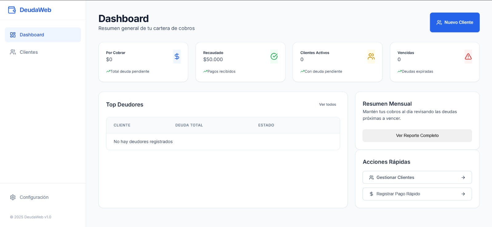
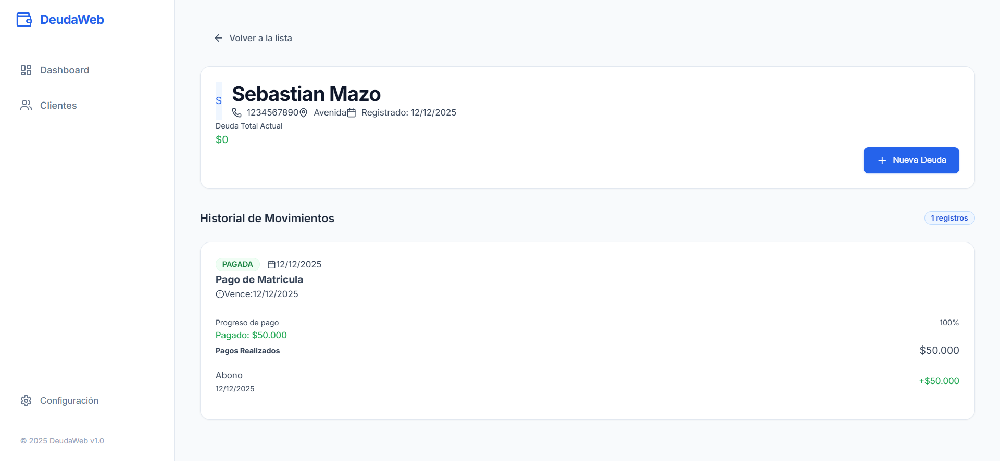

# DeudaWeb

Plantilla para un sistema de registro y control de deudas. Permite gestionar clientes, registrar deudas, registrar abonos/pagos y visualizar un resumen general (dashboard) de la cartera.

## Preview (Vercel)

Frontend (preview): Aqui tienes una preview para que mires como es el fronted de esta plantilla sin embargo mas abajo hay imagenes de sus views

[https://deuda-web.vercel.app/](https://deuda-web.vercel.app/)

Nota: esta preview solo corresponde al frontend. Por lo cual no va a funcionar ninguna funcion ya que solo es para que darte una idea de la parte visual de esta plantilla

Este repositorio contiene:

- Backend: Django + Django REST Framework (API).
- Frontend: React + TypeScript (Create React App) consumiendo la API.

## Que incluye esta plantilla

Esta plantilla esta pensada como base para un sistema real. Incluye lo esencial para:

- Crear y administrar clientes.
- Registrar deudas por cliente.
- Registrar pagos/abonos a las deudas.
- Ver estados (pendiente, vencida, pagada) y progreso de pago.
- Consultar un resumen general en el dashboard.

## Capturas (screenshots)

### Dashboard

### Lista de clientes

### Informacion de Cliente

## Estructura del proyecto

- backend/: Proyecto Django y API.
- frontend/: Aplicacion React.

## Requisitos

- Windows, macOS o Linux.
- Python 3.10+ (recomendado 3.11/3.12).
- Node.js 18+ (recomendado 20 LTS) y npm.

## Instalacion

### 1) Backend (Django)

1. Entrar a la carpeta del backend:

   backend

2. Crear y activar un entorno virtual (ejemplo en Windows PowerShell):

   python -m venv .venv
   .\.venv\Scripts\Activate.ps1

3. Instalar dependencias:

   pip install -r requirements.txt

4. Aplicar migraciones:

   python manage.py migrate

5. Iniciar el servidor:

   python manage.py runserver

La API quedara disponible en:

- http://localhost:8000/

### 2) Frontend (React + TypeScript)

1. Entrar a la carpeta del frontend:

   frontend

2. Instalar dependencias:

   npm install

3. Iniciar el servidor de desarrollo:

   npm start

La web quedara disponible en:

- http://localhost:3000/

## Base de datos

Por defecto se usa SQLite (archivo `backend/db.sqlite3`). Para produccion se recomienda Postgres.

## Contribuciones

Esta es una plantilla. Puedes extenderla agregando autenticacion, reportes, exportacion, roles y permisos, y mejoras de UI.

## Licencia

MIT. Ver el archivo ([LICENSE](https://github.com/SebassMp/DeudaWeb/blob/main/LICENSE)).
